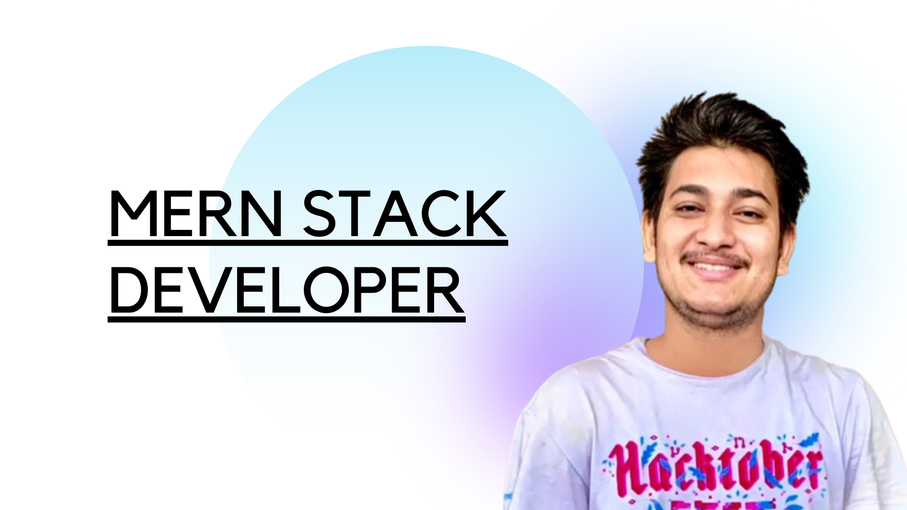

<h1 align="center">Hi , I'm Anuj</h1>
<h3 align="center"> A passionate MERN Stack developer from India</h3>

 
  

## 🙋‍♂️ About Me

- 🔭 I’m currently working on **Portfolio Builing**

- 🌱 I’m currently learning **Languages, Framework, Library**

- 👯 I’m looking to collaborate on **Open Source Contribution**

- 🤝 I’m looking for help with **Stack Overflow**

- 👨‍💻 All of my projects are available at **[Portfolio](https://anujvarshney.me/)**

- 📝 I sometimes write articles on **[Blog Website]()**

- 💬 Ask me about **react,js, node.js, express.js, nuxt.js, mongoDB**

- 📫 How to reach me **[Contact Me](anujkk1911997@gmail.com)**

- 📄 Know about my experiences **[Resume](https://drive.google.com/file/d/18bDeogUQWfTqKb21ELIU_us5IYSONTMc/view?usp=sharing)**

- ⚡ Fun fact **I play games and go to the GYM very often.**

 
<h2 align=left>
&nbsp;&nbsp;&nbsp;&nbsp;
Find me on Coding Platforms:
 </h2>

 
<h2 align=left>

Skill:</h2>

<table>
<tr>
<td><h4>Programming Languages</h4></td>
<td>
 
<!--   
    
   -->

       
</td></tr>

<tr>
<td><h4>Front-end Development</h4></td>
<td>
    
    

<a href="https://github.com/search?p=4&q=user%3Aianujvarshney+language%3AJavaScript&type=Code">
<a href="https://github.com/search?p=4&q=user%3Aianujvarshney+language%3AJavaScript&type=Code">

<!--
</td></tr> -->

<tr>
<td><h4>Backend Development & Database</h4></td>
<td>

</td></tr>

<tr>
<td><h4>Tools</h4></td>

<td>
  
<!--    -->
  

</td>
  </tr>

<!-- <tr>
<td>
    <h4>Machine/Deep Learning</h4></td>
<td> 
 
  

<tr> -->
<!--<td><h4>Miscellaneous</h4></td>
<td></td></tr> -->
</table>

  

    

## 📊 My Github Stats

   
    
  
   

<b>Note:</b> Top languages is only a metric of the languages my public code consists of and doesn't reflect experience or skill level.

<!--  -->

Detailed Summary

 

![Metrics](https://metrics.lecoq.io/ianujvarshney?template=classic&repositories.forks=true&isocalendar=1&languages=1&introduction=1&habits=1&stars=1&topics=1&reactions=1&people=1&gists=1&followup=1&lines=1&traffic=1&stargazers=1&projects=1&achievements=1&activity=1&discussions=1&support=1&repositories=1&notable=1&skyline=1&pagespeed=1&stackoverflow=1&anilist=1&tweets=1&music=1&posts=1&rss=1&wakatime=1&stock=1&screenshot=1&nightscout=1&repositories=100&repositories.batch=100&repositories.forks=true&repositories.affiliations=owner&isocalendar.duration=full-year&languages.limit=8&languages.sections=most-used&languages.colors=github&languages.threshold=0%25&languages.indepth=false&languages.categories=markup%2C%20programming&languages.recent.categories=markup%2C%20programming&languages.recent.load=300&languages.recent.days=14&introduction.title=true&habits.from=200&habits.days=14&habits.facts=true&habits.charts=true&habits.trim=false&stars.limit=4&topics.mode=starred&topics.sort=stars&topics.limit=15&reactions.limit=200&reactions.limit.issues=100&reactions.days=0&reactions.display=absolute&reactions.ignored=github-actions%5Bbot%5D%2C%20dependabot%5Bbot%5D%2C%20dependabot-preview%5Bbot%5D&people.limit=24&people.size=28&people.types=followers%2C%20following&people.identicons=false&people.shuffle=false&followup.sections=repositories&projects.limit=4&projects.descriptions=false&activity.limit=5&activity.load=300&activity.days=14&activity.filter=all&activity.visibility=all&activity.timestamps=false&achievements.threshold=C&achievements.secrets=true&achievements.display=detailed&achievements.limit=34&notable.repositories=false&skyline.year=current-year&skyline.frames=60&skyline.quality=0.5&skyline.compatibility=true&pagespeed.url=.user.website&pagespeed.detailed=false&pagespeed.screenshot=false&music.limit=13&music.played.at=false&music.user=.user.login&tweets.attachments=true&tweets.limit=2&tweets.user=ianujvarshney&anilist.medias=anime%2C%20manga&anilist.sections=favorites&anilist.limit=2&anilist.limit.characters=22&anilist.shuffle=true&anilist.user=.user.login&stackoverflow.user=1&stackoverflow.sections=answers-top%2C%20questions-recent&stackoverflow.limit=6&stackoverflow.lines=4&stackoverflow.lines.snippet=6&posts.source=dev.to&posts.descriptions=false&posts.covers=false&posts.limit=4&posts.user=.user.login&rss.limit=4&wakatime.days=7&wakatime.sections=time%2C%20projects%2C%20projects-graphs%2C%20languages%2C%20languages-graphs%2C%20editors%2C%20os&wakatime.limit=5&wakatime.url=https%3A%2F%2Fwakatime.com&wakatime.user=current&stock.duration=5d&stock.interval=5m&screenshot.title=Screenshot&screenshot.selector=body&screenshot.background=true&nightscout.url=https%3A%2F%2Fexample.herokuapp.com&nightscout.datapoints=12&nightscout.lowalert=80&nightscout.highalert=180&nightscout.urgentlowalert=50&nightscout.urgenthighalert=250&config.timezone=Asia%2FCalcutta&config.twemoji=true)

## Connect with me

## ❤ Views and Followers

 
  
  

<h3 align="left">Support:</h3>

  
