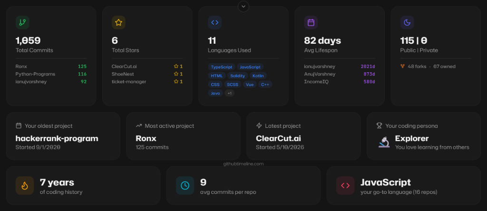
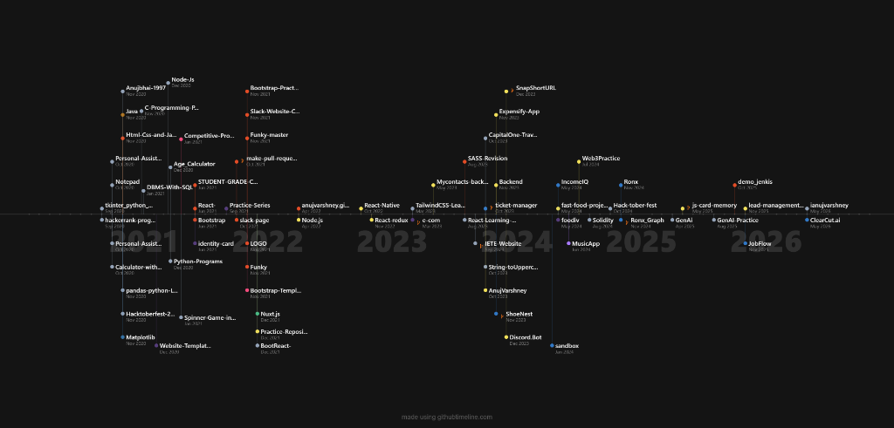

  

  
  
  
  
  
  

##

  

  
  

---

## ⭐ Key Highlights 🎯

| Product Engineering | Backend, Realtime & Web3 |
| --- | --- |
| Build scalable MERN and Next.js applications with clean UI systems | Design APIs, auth flows, and realtime services with Node.js, Express, Redis, PostgreSQL, MongoDB, and WebSockets |
| Experienced with responsive frontend architecture, reusable components, and production-ready dashboards | Work on market data pipelines, order management systems, smart contract integrations, and wallet-connected DApps |
| Delivered client and SaaS projects across React, cloud, blockchain, and business platforms | Focused on secure authentication, performance optimization, code quality, and reliable deployment workflows |

---

## 👨‍💻 About Me

- 🔭 Currently building production systems as a **Full Stack Developer at Inriser Consulting Private Limited**
- ⚙️ Working across **market data systems, OMS platforms, admin APIs, WebSockets, Redis, PostgreSQL, TimescaleDB, and AWS**
- 🌐 Previously built **DApps and MERN products** with **Next.js, TypeScript, GraphQL, Solidity, Web3.js, Ethers.js, Wagmi, MetaMask, and WalletConnect**
- 🧩 Strong with **React.js, Next.js, TypeScript, Node.js, Express.js, MongoDB, PostgreSQL, Redis, Docker, Firebase, and AWS**
- 🏆 5-Star C++ coder on HackerRank, 200+ DSA problems solved across Codeforces and CodeChef, and Hacktoberfest 2020 open-source contributor
- 📫 Reach me at **Anuj.varshneyg@gmail.com**

---

##  Tech I Use 💻

<table align="center">
  <tr>
    <td align="center" width="96"> JavaScript</td>
    <td align="center" width="96"> TypeScript</td>
    <td align="center" width="96"> React</td>
    <td align="center" width="96"> Next.js</td>
    <td align="center" width="96"> Node.js</td>
    <td align="center" width="96"> Express.js</td>
    <td align="center" width="96"> MongoDB</td>
    <td align="center" width="96"> PostgreSQL</td>
  </tr>
  <tr>
    <td align="center" width="96"> Redis</td>
    <td align="center" width="96"> GraphQL</td>
    <td align="center" width="96"> Tailwind</td>
    <td align="center" width="96"> Redux</td>
    <td align="center" width="96"> Firebase</td>
    <td align="center" width="96"> AWS</td>
    <td align="center" width="96"> Docker</td>
    <td align="center" width="96"> Nginx</td>
  </tr>
  <tr>
    <td align="center" width="96"> Solidity</td>
    <td align="center" width="96"> HTML</td>
    <td align="center" width="96"> CSS</td>
    <td align="center" width="96"> Sass</td>
    <td align="center" width="96"> Bootstrap</td>
    <td align="center" width="96"> Figma</td>
    <td align="center" width="96"> Git</td>
    <td align="center" width="96"> GitHub</td>
  </tr>
  <tr>
    <td align="center" width="96"> Python</td>
    <td align="center" width="96"> C++</td>
    <td align="center" width="96"> C</td>
    <td align="center" width="96"> Postman</td>
    <td align="center" width="96"> VS Code</td>
    <td align="center" width="96"> Vercel</td>
    <td align="center" width="96"> WordPress</td>
    <td align="center" width="96"> NPM</td>
  </tr>
  <tr>
    <td align="center" width="96"> React Native</td>
    <td align="center" width="96"> React Query</td>
    <td align="center" width="96"> React Hook Form</td>
    <td align="center" width="96"> Socket.io</td>
    <td align="center" width="96"> TimescaleDB</td>
    <td align="center" width="96"> Wagmi</td>
    <td align="center" width="96"> Ethers.js</td>
    <td align="center" width="96"> Hardhat</td>
  </tr>
  <tr>
    <td align="center" width="96"> WalletConnect</td>
    <td align="center" width="96"> MetaMask</td>
    <td align="center" width="96"> GitHub Actions</td>
  </tr>
</table>

---

## 🚀 Featured Work

| Project | Stack / Focus | Link |
| --- | --- | --- |
| **RONX** | Next.js, smart-contract powered finance experience | [Visit](https://anuj-varshney.vercel.app/) |
| **TEMPO** | React event creation platform | [Visit](https://tempo.live/) |
| **IQUINCESOFT** | React company web application | [Visit](https://iquincesoft.com/) |
| **CARITAS REVOLUTION** | React charity revolution platform | [Visit](https://caritasrevolution.org/) |

---

## 💼 Experience Snapshot

| Role | Company | Focus |
| --- | --- | --- |
| **Full Stack Developer** | Inriser Consulting Private Limited | Realtime market data, OMS architecture, PostgreSQL, TimescaleDB, Redis, WebSockets, secure admin APIs, GitHub Actions |
| **MERN Stack Developer / Blockchain Enthusiast** | All Digital | DApps, Next.js, TypeScript, GraphQL, Web3.js, Solidity, Hardhat, wallet integrations |
| **MERN Stack Developer** | QHR Solution | SaaS APIs, MongoDB optimization, authentication, product workflows, performance improvements |
| **React Developer** | iQuincesoft Pvt Ltd. | Client projects, reusable React components, responsive UI delivery |

---

## 📊 My GitHub Stats

  
  

  

  

  

---

## 🌐 Connect With Me

  
  
  
  
  
  
  

  

